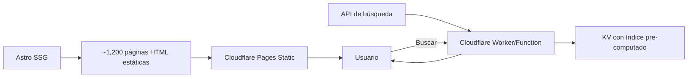

# ⚖️ Estático vs Cloudflare Workers — Análisis para Biblia Susana

## TL;DR — Recomendación

> [!IMPORTANT]
> **Recomiendo mantener estático pero migrar de Netlify a Cloudflare Pages (estático).** Si en el futuro necesitas features dinámicas (búsqueda server-side, API, auth), puedes agregar Workers incrementalmente sin reconstruir todo.

---

## Skills Disponibles ✅

Tenemos todo lo necesario para cualquier enfoque:

| Skill | Contenido | ¿Necesaria? |
|:------|:----------|:-----------:|
| `cloudflare` | Workers, Pages, KV, D1, R2, AI, Vectorize | ✅ Para migración |
| `wrangler` | CLI completo: deploy, KV, D1, Pages | ✅ Para despliegue |
| `astro-framework` | SSR adapters (incluye Cloudflare), Content Collections, View Transitions | ✅ Para SSR si se necesita |
| `astro` / `astro-dev` | Desarrollo con Astro | ✅ Base |
| `web-perf` | Optimización web | ✅ Para mejoras |

---

## Comparación Detallada

### Opción A: Estático (actual Netlify → Cloudflare Pages)


| Criterio | Evaluación |
|:---------|:-----------|
| **Velocidad** | ⭐⭐⭐⭐⭐ HTML pre-renderizado, TTFB ~20ms desde CDN global |
| **Costo** | ⭐⭐⭐⭐⭐ **$0/mes** — Cloudflare Pages Free: sitios ilimitados, ancho de banda ilimitado |
| **Complejidad** | ⭐⭐⭐⭐⭐ Cero servidor, cero base de datos, cero mantenimiento |
| **Búsqueda** | ⭐⭐⭐ El JSON (~3-5MB) se descarga completo al browser |
| **SEO** | ⭐⭐⭐⭐⭐ Todo es HTML estático, perfecto para crawlers |
| **Offline** | ⭐⭐⭐⭐ Fácil de cachear con Service Worker (PWA) |

**Ventajas clave:**
- La Biblia no cambia, no necesita datos dinámicos
- ~1,200 páginas pre-renderizadas = carga instantánea
- Sin cold starts ni latencia de servidor
- Ideal para la audiencia (navegación simple, sin login)

**Limitaciones:**
- Búsqueda depende de descargar el JSON completo (lento en 3G)
- No puede tener features "dinámicas" (favoritos sincronizados, notas compartidas)

---

### Opción B: Cloudflare Workers (SSR completo)


| Criterio | Evaluación |
|:---------|:-----------|
| **Velocidad** | ⭐⭐⭐⭐ Rápido edge rendering (~50ms), pero con cold start posible |
| **Costo** | ⭐⭐⭐⭐ Free tier: 100K requests/día (más que suficiente) |
| **Complejidad** | ⭐⭐⭐ Requiere adapter, wrangler config, bindings, testing local |
| **Búsqueda** | ⭐⭐⭐⭐⭐ Puede buscar server-side en KV/D1 (no descargar JSON) |
| **SEO** | ⭐⭐⭐⭐⭐ HTML renderizado en el server |
| **Offline** | ⭐⭐ Más complejo para cachear (SW + cache strategy) |

**Ventajas:**
- Búsqueda server-side (no descargar el JSON gigante)
- Base para features futuras: favoritos con D1, notas, auth
- Workers AI para búsqueda semántica ("versículos sobre el perdón")

**Desventajas:**
- **Sobre-ingeniería** para el caso actual (contenido 100% estático)
- Mayor complejidad de desarrollo y deploy
- Cold starts posibles en el edge
- Requiere debugging con `wrangler dev` en vez de solo `astro dev`

---

### Opción C: Híbrido (⭐ RECOMENDADA)



| Paso | Qué hacer | Cuándo |
|:-----|:----------|:-------|
| **Fase 1** | Migrar a Cloudflare Pages **estático** | Ahora |
| **Fase 2** | Agregar Pages Function para búsqueda server-side | Cuando la búsqueda sea lenta |
| **Fase 3** | Agregar D1 para favoritos/notas (si lo necesitas) | Cuando lo pida Susana |

---

## ¿Por qué NO Workers SSR completo ahora?

1. **La Biblia no cambia.** No hay razón para renderizar en cada request lo que se puede pre-renderizar una vez.
2. **31K versículos ÷ ~66 libros ÷ ~1,189 capítulos = ~1,200 páginas.** Astro genera esto en segundos.
3. **La audiencia (adulto mayor) navega libro → capítulo → versículo.** No es un dashboard dinámico.
4. **Cloudflare Pages Free** ofrece ancho de banda ilimitado. Workers Free tiene límite de 100K req/día.
5. **Complejidad innecesaria.** `wrangler.jsonc`, bindings, adapter config, testing local... todo por contenido que no cambia.

---

## Migración Concreta: Netlify → Cloudflare Pages (Estático)

Si apruebas, estos son los cambios necesarios:

### Cambios mínimos

```diff
# package.json - sin cambios necesarios para estático

# astro.config.mjs - sin cambios para static output (default)

# netlify.toml → ELIMINAR (ya no es necesario)

# Nuevo: wrangler.jsonc (opcional, para usar wrangler pages deploy)
```

### Opciones de deploy

**Opción 1 — Git integration (más fácil):**
- Conectar el repo de GitHub a Cloudflare Pages dashboard
- Build command: `pnpm build`
- Output dir: `dist`
- Cada push a `main` = deploy automático

**Opción 2 — CLI con Wrangler:**
```bash
pnpm build
npx wrangler pages deploy ./dist --project-name biblia-susana
```

### Para la búsqueda (Fase 2, opcional)

Agregar una **Pages Function** que busque en un índice KV pre-computado:

```
functions/
  api/
    search.ts  ← Pages Function (Worker edge)
```

Esto permite hacer `/api/search?q=amor` sin descargar todo el JSON al browser.

---

## Veredicto Final

| Aspecto | Netlify (actual) | CF Pages Static | CF Workers SSR |
|:--------|:-----:|:-----:|:-----:|
| Costo | Free (100GB BW) | **Free (ilimitado)** | Free (100K req/día) |
| Velocidad | ⭐⭐⭐⭐ | ⭐⭐⭐⭐⭐ | ⭐⭐⭐⭐ |
| Complejidad | ⭐⭐⭐⭐⭐ | ⭐⭐⭐⭐⭐ | ⭐⭐⭐ |
| Escalabilidad futura | ⭐⭐⭐ | ⭐⭐⭐⭐⭐ | ⭐⭐⭐⭐⭐ |
| Skills disponibles | N/A | ✅ Todas | ✅ Todas |

> [!TIP]
> **Cloudflare Pages estático** te da la misma simplicidad actual + ancho de banda ilimitado + la puerta abierta para agregar Workers/KV/D1 cuando realmente lo necesites. Es el mejor de ambos mundos.
